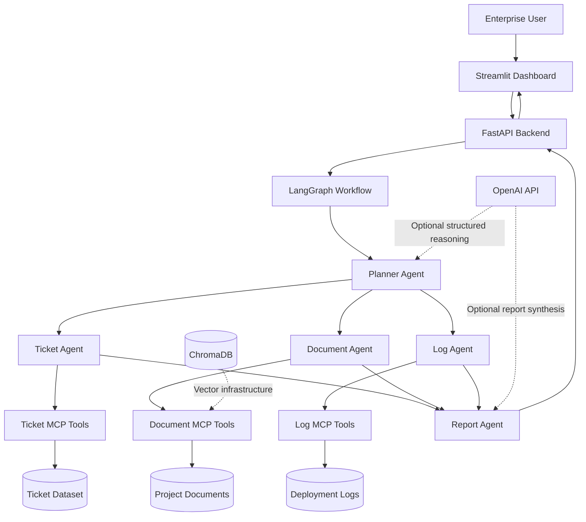

# Enterprise AI Operations Assistant

A production-style AI operations copilot that investigates enterprise incidents by correlating Jira-style tickets, project documents, and deployment logs.

The system combines FastMCP tools, a LangGraph multi-agent workflow, FastAPI APIs, a Streamlit dashboard, ChromaDB infrastructure, OpenAI integration, and Docker Compose deployment.

## What It Does

Users can ask operational questions such as:

```text
Why did the production dashboard deployment fail?
Show blockers related to authentication incidents.
Find recent database migration errors.
What remediation is recommended for API timeouts?
```

The assistant plans the investigation, searches relevant enterprise sources in parallel, and returns a structured report containing:

- A grounded answer
- Source citations
- Confidence level
- Probable causes
- Recommended next actions
- Agent execution trace
- MCP tool-call details

## Architecture



## Technology Stack

| Layer | Technology |
|---|---|
| Language | Python 3.11+ |
| Agent orchestration | LangGraph |
| Tool protocol | FastMCP |
| Backend API | FastAPI |
| Frontend | Streamlit |
| Vector database | ChromaDB |
| LLM integration | OpenAI API |
| Validation | Pydantic |
| Deployment | Docker Compose |

## Multi-Agent Workflow

```text
User Question
    |
    v
Planner Agent
    |
    +----------------+----------------+
    |                |                |
    v                v                v
Ticket Agent   Document Agent     Log Agent
    |                |                |
    +----------------+----------------+
                     |
                     v
                Report Agent
                     |
                     v
       Answer + Evidence + Citations
```

### Agents

- **Planner Agent:** Detects intent, extracts entities, selects sources, and creates tool plans.
- **Ticket Agent:** Searches incidents, priorities, owners, dependencies, and blockers.
- **Document Agent:** Retrieves architecture documents, release plans, procedures, meeting notes, and incident reports.
- **Log Agent:** Investigates deployment failures, authentication errors, migrations, and API timeouts.
- **Report Agent:** Combines evidence into a structured operational report.

## Enterprise Dataset

The repository includes deterministic synthetic data for an AI Dashboard project:

| Dataset | Records |
|---|---:|
| Jira-style tickets | 150 |
| Project documents | 50 |
| Deployment logs | 50 |

Generate the datasets again with:

```powershell
python scripts\generate_all_datasets.py
```

Validate them with:

```powershell
python scripts\validate_seed_data.py
```

## MCP Servers

Three independent FastMCP servers expose controlled enterprise tools.

### Ticket MCP Server

```text
search_tickets
get_ticket_by_id
list_open_tickets
list_blockers
```

### Document MCP Server

```text
search_documents
get_document
```

### Log MCP Server

```text
search_logs
get_recent_failures
```

## FastAPI Endpoints

| Method | Endpoint | Purpose |
|---|---|---|
| `GET` | `/health` | Service health |
| `POST` | `/query` | Run the complete LangGraph workflow |
| `POST` | `/chat` | Chat-style assistant interface |
| `GET` | `/tickets` | Search and filter tickets |
| `GET` | `/logs` | Search logs or list recent failures |

Interactive OpenAPI documentation is available at:

```text
http://127.0.0.1:8000/docs
```

### Query Example

```powershell
Invoke-RestMethod `
  -Method Post `
  -Uri http://127.0.0.1:8000/query `
  -ContentType "application/json" `
  -Body '{"question":"Why did the production deployment fail?","include_debug":true}'
```

## Streamlit Dashboard

The dashboard provides:

1. Copilot chat
2. Ticket viewer
3. Deployment log viewer
4. Retrieved document viewer
5. Agent execution trace
6. MCP tool-call visualization

Default URL:

```text
http://127.0.0.1:8501
```

## Local Setup

### 1. Create a Virtual Environment

```powershell
python -m venv .venv
.\.venv\Scripts\Activate.ps1
```

### 2. Install Dependencies

```powershell
python -m pip install --upgrade pip
python -m pip install -e .
```

### 3. Configure Environment Variables

Create `.env` from the example:

```powershell
Copy-Item .env.example .env
```

Add an OpenAI key if LLM planning and synthesis are required:

```text
OPENAI_API_KEY=your-key
OPENAI_MODEL=gpt-4.1-mini
```

The application also works without an OpenAI key by using deterministic planning and report generation.

### 4. Start FastAPI

```powershell
python scripts\run_api.py
```

### 5. Start Streamlit

Open a second terminal:

```powershell
python scripts\run_streamlit.py
```

## Docker Deployment

Start the complete stack:

```powershell
docker compose up --build
```

Services:

| Service | URL |
|---|---|
| Streamlit | http://127.0.0.1:8501 |
| FastAPI | http://127.0.0.1:8000 |
| OpenAPI docs | http://127.0.0.1:8000/docs |
| ChromaDB | http://127.0.0.1:8001 |
| Ticket MCP | http://127.0.0.1:8101/health |
| Document MCP | http://127.0.0.1:8102/health |
| Log MCP | http://127.0.0.1:8103/health |

Stop the stack:

```powershell
docker compose down
```

Remove containers and persisted ChromaDB data:

```powershell
docker compose down -v
```

## Validation

Run the available validation scripts:

```powershell
python scripts\validate_seed_data.py
python scripts\validate_mcp_data_access.py
python scripts\validate_langgraph_workflow.py
python scripts\validate_api.py
python scripts\validate_streamlit_frontend.py
```

After starting Docker Compose:

```powershell
python scripts\docker_smoke_test.py
```

## Project Structure

```text
enterprise-ai-ops-assistant/
|-- app/
|   |-- agents/          LangGraph agents and state
|   |-- api/             FastAPI routes and schemas
|   |-- core/            Configuration, logging, errors
|   |-- frontend/        Streamlit client and styling
|   `-- services/        LangGraph application service
|-- data/
|   `-- seed/            Synthetic enterprise datasets
|-- docker/              Dockerfiles and startup scripts
|-- docs/                Phase-by-phase documentation
|-- mcp_servers/         FastMCP servers and shared repository
|-- scripts/             Generators, runners, and validators
|-- docker-compose.yml
|-- pyproject.toml
`-- streamlit_app.py
```

## Reliability Features

- Typed Pydantic input and output models
- Parallel LangGraph retrieval branches
- LangGraph node retry policies
- MCP tool-call retries
- Controlled error responses
- Structured logging
- Health checks
- OpenAPI schemas
- Docker restart policies
- Non-root application containers
- Persistent ChromaDB volume
- Local fallback when OpenAI is unavailable

## Current Implementation Note

The default LangGraph execution path currently uses an MCP-compatible local tool adapter over the JSON repository. The standalone MCP HTTP servers and ChromaDB service are deployed independently and ready for deeper integration.

The next production evolution would connect LangGraph directly to the network MCP servers and add embedding ingestion plus semantic retrieval through ChromaDB.

## Security

- Never commit `.env`, `.env.docker`, API keys, or credentials.
- Use `.env.example` and `.env.docker.example` as templates.
- Inject secrets through the deployment platform in production.
- Add authentication, authorization, tenant isolation, and rate limiting before exposing the application publicly.

## License

This project is intended for learning, demonstration, and portfolio use. Add a license file before distributing it as an open-source project.
